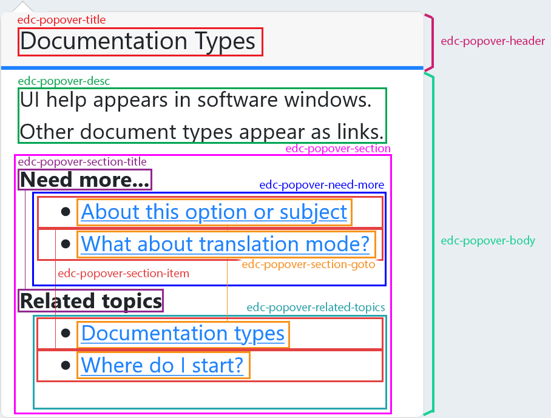

## edc-popover-utils

[](https://travis-ci.org/tech-advantage/edc-popover-utils)
[](https://badge.fury.io/js/edc-popover-utils)

A lightweight javascript edc popover for displaying the contextual help, based only on [tippy.js](https://atomiks.github.io/tippyjs/).

_This project is meant to be used with **easy doc contents** (aka edc)._

edc is a simple yet powerful tool for agile-like documentation management.

Learn more at [https://www.easydoccontents.com](https://www.easydoccontents.com).

## Dependencies

No extra dependency to install.

## How to use

### Import

You can import this module with `npm` by running:
```bash
npm install edc-popover-utils --save
```

Or with `yarn`:
```bash
yarn add edc-popover-utils
```

### Setup

To build the popover, you need to provide the following configuration object:

```typescript

/**
 * Configuration for the popover, passed as an input from the host element
 *
 * target: A reference of the target element that will trigger the popover
 * icon: The class name to use for the icon
 * content: The popover's content: the title for the header, the description, articles and links for the body
 * labels: The popover labels
 * options: Popover customizations
 */
export class PopoverConfig {
    target: Element;
    icon: string;
    content: PopoverContent;
    labels: PopoverLabels;
    options?: IPopoverOptions;
}
```

Content is the popover main items: title, description, articles and links: 
```typescript

/**
 * This class will contain the different content parts of the popover
 *
 * title: Will be set to the header
 * description: The description for the brick, under the title
 * articles: list of articles belonging to the brick
 * links: list of related documents, linked to this specific brick
 *
 */
export class PopoverContent {

    constructor(public title = '',
                public description = '',
                public articles: PopoverItem[] = [],
                public links: PopoverItem[] = []) {
    }
}

```
You just can call the constructor, passing the configuration object

```javascript

const myPopoverInstance = new Popover(popoverConfig);

```

Available options are :
| Property | Type | Description | Default |
|---|---|---|---|
| placement | popper.js `Placement` | The popover placement | `bottom` |
| hideOnClick | `boolean` | If true, any click in the document will close the popover | `true` |
| interactive | `boolean` | Determine if we can interact with the popover content | `true` |
| trigger | `string` | Event that will trigger the popover: `click` `mouseenter` `focus` | `click` |
| customClass | `string` | class name that will be added to the main popover container | undefined |
| dark | `boolean` | Dark mode | `false` |
| theme | `string` | Popover's theme name | `undefined` |
| displaySeparator | `boolean` | Show / Hide the line between header and body | `true` |
| displayTitle | `boolean` | Show / Hide the header containing the title - if false, will hide the separator | `true` |
| displayArticles | `boolean` | Show / Hide the articles section | `true` |
| displayRelatedTopics | `boolean` | Show / Hide the related Topics (aka Links) section | `true` |
| displayTooltip | `boolean` | Show / Hide the icon tooltip | `true` |
| displayPopover | `boolean` | If false, clicking on the icon will open the web help viewer on the first article, instead of showing the popover | `true` |
| delay | `number | [number, number]` | Delay in milliseconds before showing the popover - if array, delay for opening and closing respectively | `undefined` |
| animation | `Animation` | Adds a animation when opening / closing the popover | `0` |
| appendTo | `parent | Element | (() => Element)` | The element to which append the popover to | `(() => documentation.body)` |

### Customization

You can customize the popover with CSS classes as described below :



When dark mode is enabled, an HTML attribute `data-theme` set to `edcDark` is applied on the `.tippy-box` div.

## Tests

### Unit

You can test the project by running:
```bash
npm run test
```
or
```bash
yarn test
```
